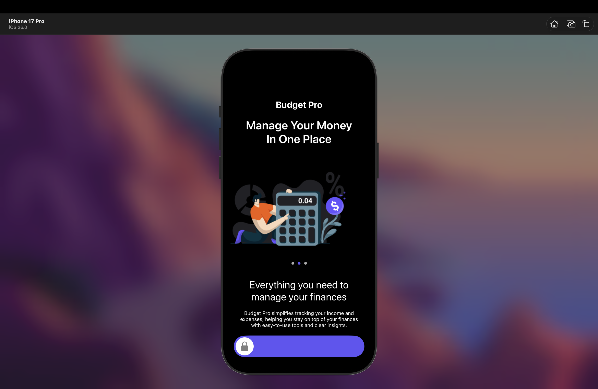
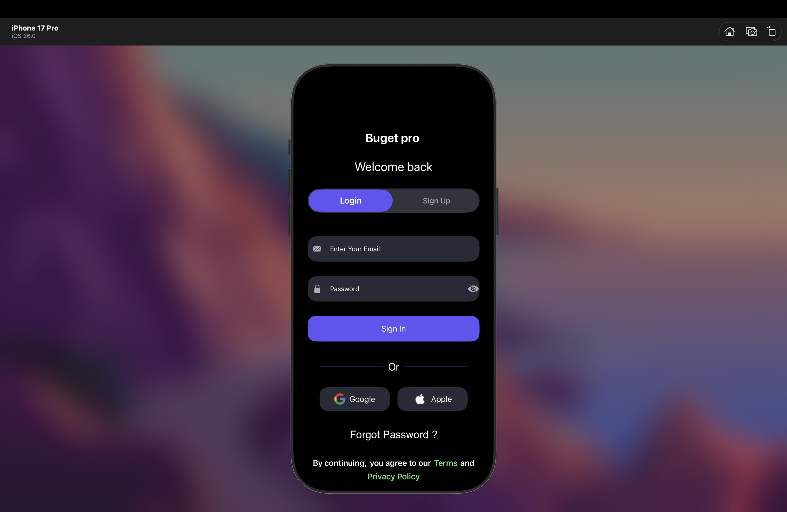
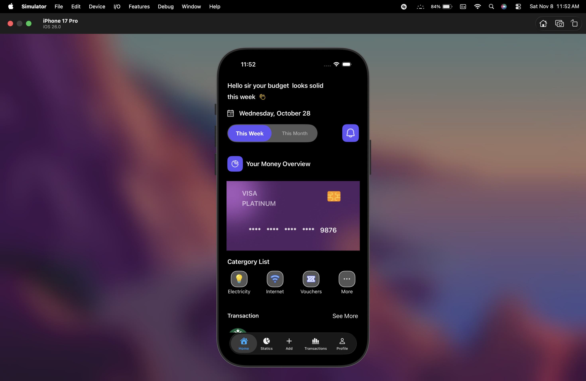
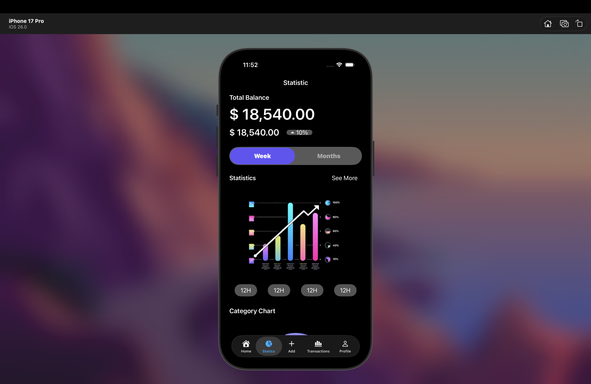
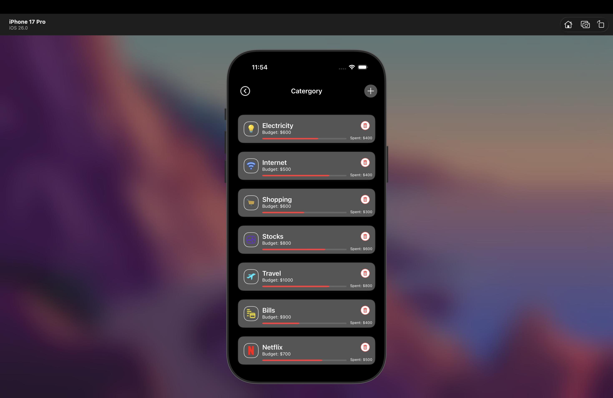
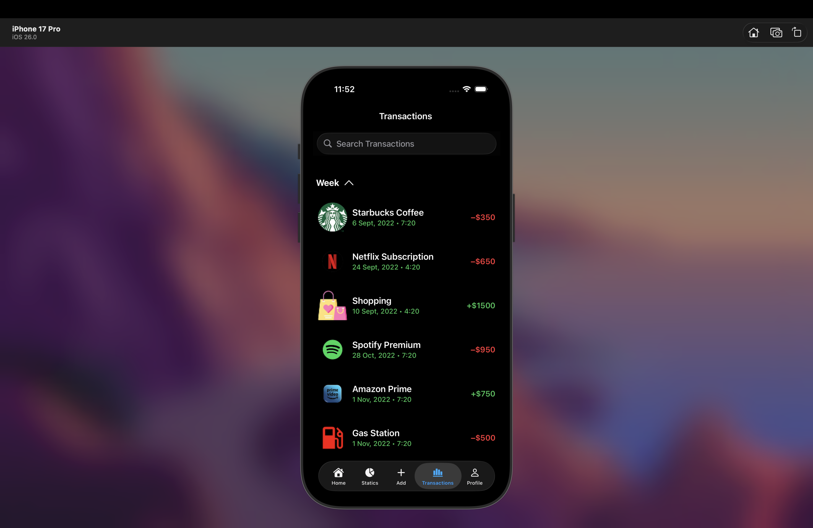

# 💰 BudgetPro — Personal Finance Tracker App

**BudgetPro** is a modern iOS app to manage income, expenses, and savings — built with **UIKit**, **Core Data**, and the **MVVM architecture**.  
It features **custom slider transitions**, **dynamic API updates**, and **offline storage**, providing a smooth and real-world app experience.  

---

## 🧩 Features

- 💵 **Add / Edit / Delete** income and expense entries  
- 📊 **Track total balance** and category-wise spending  
- 📅 **Monthly summary** with persistent data via Core Data  
- 🌐 **API integration** for currency or exchange-rate data (if used)  
- 🎨 **Custom Slider Transition** animations between views  
- 🧱 **MVVM architecture** for clean and scalable code  
- 💾 **Offline storage** using Core Data  
- 📱 **Fully responsive UI** with Auto Layout  

---

## 🖥️ Screenshots

**Main Screens**
| Launch Screen | Login Screen | Dashboard | Category Icon Upload |
|---------------|-------------|-----------|--------------------|
|  |  |  |  |

**Detailed / Other Screens**
| Monthly Summary | Category View | Transaction | Profile |
|----------------|---------------|------------|---------|
|  |  |  |  |

> *All screenshots are stored inside the `/screenshots` folder.*

---

## 🛠️ Tech Stack

- **Language:** Swift 5  
- **Framework:** UIKit  
- **Architecture:** MVVM  
- **Database:** Core Data  
- **Networking:** URLSession / API Fetching  
- **UI:** Auto Layout & Storyboards  

---

## 🚀 How to Run

1. Clone the repository:  
   ```bash
   git clone https://github.com/rohit0007ch/BudgetPro.git
   cd BudgetPro
   open BudgetPro.xcodeproj
## 🧑‍💻 Author

**Rohit** — iOS Developer  
📧 rc11102003@gmail.com  
🌐 Portfolio Website


## ⭐ Support

If you like BudgetPro, please ⭐ the repo — it helps and motivates further updates!
